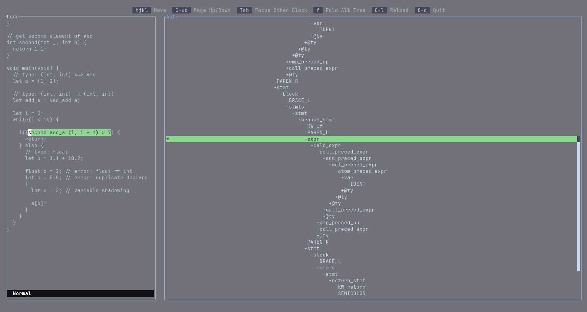

<div align="center">

# ⛰️ Astuin

AST explorer in TUI that every CSIE student dream of.



</div>

Astuin is a ast-explorer-like tui tool.

The primary use of this is for CSIE student that learning/building compiler.

If you want someting to view the custom ast instead of `print` everywhere,
or too lazy to build a proper ast viewer, this is the one for you.

## Feature

- Mouse support
- Vim-like keymap
- Simple ast format

The ast format look like this:

```sexpr
(node_name
  (@span start-line start-col end-line end-col)
  Something
  (child_node
    ...
  )
)
```

The span is half-open (bounded inclusively below and exclusively above).

`@span` is a special key it specify the span of it's parent.

A real sexpr ast look like this:

```sexpr
(file
  (@span 0 0 1 1)
  (decls
    (@span 0 0 1 1)
    (decl
      (@span 0 0 1 1)
      (fn_decl
        (@span 0 0 1 1)
        (ty
          (@span 0 0 0 4)
          (ty_kind
            (@span 0 0 0 4)
            (TY_void
              (@span 0 0 0 4)
            )
          )
        )
        (IDENT
          (@span 0 5 0 9)
        )
        (params
          (@span 0 9 0 11)
          (PAREN_L
            (@span 0 9 0 10)
          )
          (PAREN_R
            (@span 0 10 0 11)
          )
        )
        (block
          (@span 0 11 1 1)
          (
            BRACE_L
            (@span 0 11 0 12)
          )
          (
            stmts
            (@span 1 0 0 12)
          )
          (BRACE_R
            (@span 1 0 1 1)
          )
        )
        (@ty ". -> .")
      )
    )
    (decls
      (@span 3 0 1 1)
    )
  )
)
```

Also there is [a project of mine](https://github.com/KAIYOHUGO/CFood) using astuin.

## Usage

Very simple!
You need have a command that accept the code as stdin,
and the ast should at the **last line** of the stdout.

The extra output (the thing not at last line) is treat as a special node in tree view.

```
astuin "the shell you want to run every time when C-l is press"
```

## Installation

### Nix

Add `cosmic-tomat` to  flake inputs.

```nix
{
  inputs = {
    // ...
    astuin = {
      url = "github:kaiyohugo/astuin";
      inputs.nixpkgs.follows = "nixpkgs";
    };
  }
  // ...
}
```

And add astuin to package

```nix
environment.systemPackages = [
  inputs.astuin.packages."<system>".default
];

```

### Other

Build from source

```
cargo install --git https://github.com/kaiyohugo/astuin.git
```
